# AiKita.Planning

- [User stories](syp/user_stories.md)
- [Process documentation](syp/ProcessDocumentation.md)


# Timeline

```mermaid
gantt
    title AiKita
    dateFormat  MM
    axisFormat  %b

    section Planning
    Kick-off & Discovery :done, p1, 2025-01-01, 2w
    Techstack and Design :active, p2, after p1, 4w
    Planning :p3, after p2, 6w

    section MVP
    MVP Development :p4, 2025-04-01, 10w
    Integration & Testing :p5, after p4, 3w

    section Connecting the Dots
    MVP+ :p6, 2025-09-01, 6w
    AI ? :p7, 2025-09-01, 6w
    DB's :p8, 2025-09-01, 6w
    Security :p9, 2025-09-01, 6w

    section Pre Launch
    Final Integration :p10, 2025-10-15, 6w
    Alpha Testing :p11, after p10, 4w

    section Launch Prep
    Beta Testing :p12, after p11, 4w
    Bugfixing & Finetuning :p13, 2026-02-01, 2w

    section Release Candidate
    RC :p14, after p13, 2w
    Bugfixing & Finetuning :p15, after p14, 2w
    v1.0 :p16, after p15, 2w
```




# Techstack

```c
+-------------------------------------------------------+
|              Local Desktop Application                |
|          (Angular + Electron/Tauri + C#/.NET)         |
|                                                       |
|  +-----------------------------------------------+    |
|  | Desktop UI (Angular + Electron or Tauri)      |    |
|  | Data Entry & User Interaction                 |    |
|  +------------------------+----------------------+    |
|                           |                           |
|                           v                           |
|  +-----------------------------------------------+    |
|  | Local Data Anonymization API (.NET Web API)   |    |
|  +------------------------+----------------------+    |
|                           |                           |
|                           v                           |
|  +-----------------------------------------------+    |
|  | Local Database (SQLite or SQL Server Express) |    |
|  | with Encryption (SQLCipher or TDE)            |    |
|  +------------------------+----------------------+    |
|                           |                           |
|                           v                           |
|  +-----------------------------------------------+    |
|  | JSON Serialization (System.Text.Json in .NET) |    |
|  +------------------------+----------------------+    |
|                           |                           |
|                           v                           |
|  +-----------------------------------------------+    |
|  | Secure Transmission (HTTPClient/.NET HTTPS)   |    |
|  +------------------------+----------------------+    |
+---------------------------|---------------------------+
                            |
                            v
                [Internet / Secure Channel (HTTPS)]

                               |
                               v
+-------------------------------------------------------------+
|                      Cloud Backend (.NET)                   |
|                                                             |
|  +-------------------------------------------------------+  |
|  | ASP.NET Core Web API                                  |  |
|  +---------------------------+---------------------------+  |
|                              |                              |
|                              v                              |
|  +-------------------------------------------------------+  |
|  | PostgreSQL or SQL Server (Azure SQL or managed DB)    |  |
|  +---------------------------+---------------------------+  |
|                              |                              |
|                              v                              |
|  +-------------------------------------------------------+  |
|  | Background Tasks & Queue (Hangfire / Quartz.NET)      |  |
|  | using Redis or RabbitMQ                               |  |
|  +---------------------------+---------------------------+  |
|                              |                              |
|                              v                              |
|  +-------------------------------------------------------+  |
|  | AI Analysis (ML.NET / ONNX Runtime / TensorFlow.NET)     |
|  +---------------------------+---------------------------+  |
|                              |                              |
|                              v                              |
|  +-------------------------------------------------------+  |
|  | Vector Database (Qdrant / Weaviate via REST APIs)     |  |
|  +---------------------------+---------------------------+  |
|                              |                              |
|                              v                              |
|  +-------------------------------------------------------+  |
|  | Admin Interface & Web Frontend (Angular + TypeScript) |  |
|  +-------------------------------------------------------+  |
+-------------------------------------------------------------+

```


